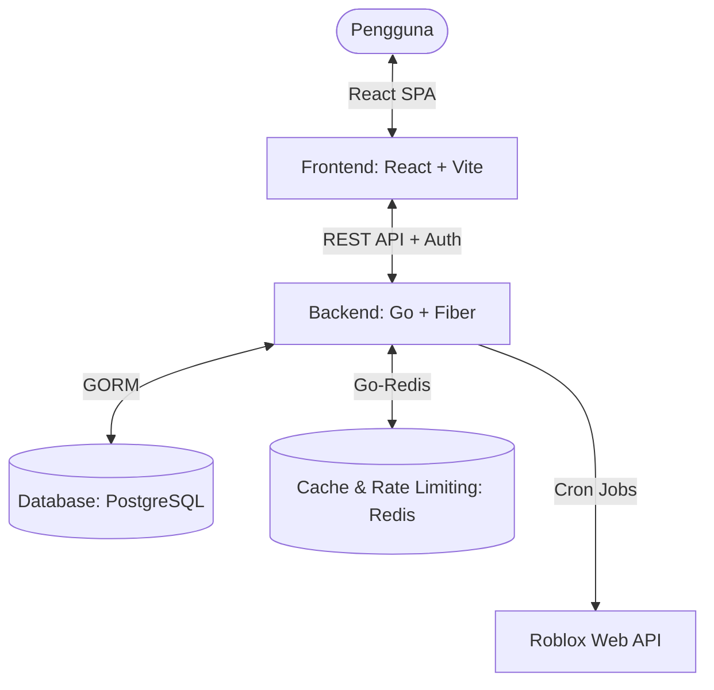

# Analisis Proyek: Roblox Friends Tracker (V3)

Dokumen ini menyajikan analisis komprehensif mengenai arsitektur, fitur, alur kerja, keamanan, serta area peningkatan untuk proyek **Roblox Friends Tracker (V3)** yang telah kita kembangkan bersama.

---

## 1. Ikhtisar Sistem (System Overview)

Roblox Friends Tracker adalah aplikasi web modern yang dirancang untuk melacak aktivitas, kehadiran (*presence*), dan perubahan profil dari teman-teman pengguna di platform Roblox secara otomatis dan berkala.

### Arsitektur Utama

---

## 2. Struktur Kode & Komponen Teknis

### A. Backend (Go + Fiber + GORM)
Backend dirancang menggunakan arsitektur modular yang membagi tanggung jawab berdasarkan fungsionalitasnya:

*   **`main.go`**: Titik masuk (*entry point*) aplikasi, registrasi middleware (CORS, Rate Limiter, Recovery), pendefinisian rute API, dan inisialisasi server Fiber di port `7000`.
*   **`models/`**: Representasi skema database PostgreSQL menggunakan GORM:
    *   `User`: Menyimpan data kredensial, preferensi (Stealth Mode), dan `AdminNote`.
    *   `Friend`: Tabel relasi pertemanan yang menghubungkan pengguna dengan target pelacakan, lengkap dengan bidang `Note` dan `Status` pelacakan.
    *   `ActivityLog`: Mencatat riwayat kehadiran (`Online`, `In-Game`, dll.) beserta game yang sedang dimainkan.
    *   `ProfileChangeLog`: Mencatat perubahan nama, display name, atau avatar.
*   **`handlers/`**: Logika pengendali API:
    *   `auth.go`: Mengatur registrasi, login JWT, dan logout.
    *   `friends.go`: Mengatur manipulasi daftar teman, manual sync, serta penambahan catatan (*notes*).
    *   `admin.go`: Menyediakan kontrol penuh bagi Administrator, termasuk visualisasi pelacakan invers (*tracked-by*), pencatatan admin (*admin-note*), dan pencadangan database (*pg_dump backup*).
*   **`cron/`**: Menjalankan *background worker* secara berkala untuk melakukan polling ke API Roblox guna mendeteksi perubahan status dan profil secara *real-time*.
*   **`cache/`**: Integrasi Redis untuk manajemen token blacklist, optimasi kueri, dan rate limiting.

### B. Frontend (React + Vite)
Frontend dikembangkan sebagai Single Page Application (SPA) yang cepat dan dinamis dengan fokus pada *User Experience (UX)* premium:

*   **`App.jsx`**: Komponen induk yang mengatur perutean tampilan (Dashboard vs Admin Panel), autentikasi, serta state utama daftar teman.
*   **`AdminDashboard.jsx`**: Panel administrasi yang kaya fitur dengan filter multi-kondisi (tipe akun, status kehadiran), pencarian real-time, detail log aktivitas, dan visualisasi siapa melacak siapa.
*   **`FriendCard.jsx`**: Komponen visual interaktif untuk menampilkan status teman secara real-time, lengkap dengan fungsionalitas inline note editor yang instan.

---

## 3. Fitur Utama yang Telah Diimplementasikan

Berikut adalah daftar fitur canggih yang membedakan proyek ini dari pelacak aktivitas standar:

| Fitur | Kategori | Deskripsi | Status |
| :--- | :--- | :--- | :--- |
| **Real-time Presence Polling** | Core | Background worker mendeteksi perubahan status kehadiran (Online, Offline, In-Game, In-Studio) secara periodik. | **Aktif** |
| **Profile Change History** | Core | Melacak dan mendokumentasikan setiap kali target mengubah Avatar, Username, atau Display Name (menyimpan nilai *Lama* vs *Baru*). | **Aktif** |
| **Stealth Mode (Mode Siluman)** | Privasi | Pengguna dapat menyembunyikan status kehadiran mereka sendiri dari pelacak lain dengan opsi pengecualian (*exemptions*). | **Aktif** |
| **User Personalized Notes** | UX | Setiap pengguna dapat menyematkan catatan pribadi (Note) pada teman yang dilacak secara langsung di Dashboard. | **Aktif** |
| **Reverse Tracker (Tracked By)** | Admin | Admin dapat melihat daftar akun mana saja yang mensinkronkan/melacak pengguna tertentu untuk analisis jaringan. | **Aktif** |
| **Admin Specific Notes** | Admin | Catatan rahasia khusus yang hanya bisa diakses, dibaca, dan ditulis oleh Administrator untuk keperluan audit internal. | **Aktif** |
| **Native DB Backup (pg_dump)** | Ops | Fitur satu-klik bagi Admin untuk mengunduh salinan database PostgreSQL asli (`.sql`) secara instan dan aman dari kontainer Docker. | **Aktif** |

---

## 4. Evaluasi Keamanan & Performa

### Aspek Keamanan (Security)
1.  **Stateless JWT Authentication**: Setiap API terproteksi memerlukan token JWT yang valid dalam header otorisasi.
2.  **Role-Based Access Control (RBAC)**: Pembatasan ketat untuk endpoint admin (`/api/admin/...`) menggunakan pemeriksaan tingkat role pada middleware.
3.  **Strict Rate Limiting**: Membatasi spamming permintaan API (khususnya untuk fitur manual sync) menggunakan Redis key-value expiration guna mencegah serangan DDoS/Brute Force.
4.  **Database Connection Pooling**: Mencegah kebocoran koneksi ke PostgreSQL dengan konfigurasi limit MaxOpenConns (20) dan MaxIdleConns (10).

### Aspek Performa (Performance)
1.  **Non-Blocking Background Workers**: Penggunaan Goroutines pada sistem Cron memastikan pelacakan berkala berjalan di thread terpisah tanpa membebani performa REST API utama.
2.  **Pagination & Offset Limit**: Log aktivitas dan daftar riwayat pada modal dibatasi maksimal 100 baris dengan fitur *Load More* dinamis untuk meminimalkan beban memori di browser dan server.

---

## 5. Rekomendasi Pengembangan Lebih Lanjut (Future Roadmap)

Untuk membuat sistem ini menjadi lebih andal dan berskala industri (*enterprise-ready*), berikut adalah beberapa peningkatan yang direkomendasikan:

> [!TIP]
> **1. Integrasi WebSocket**
> Mengganti polling berkala pada frontend dengan koneksi WebSocket (misalnya menggunakan *Fiber WebSockets*) agar perubahan status teman yang dideteksi oleh backend cron job dapat langsung tampil di browser pengguna secara instan tanpa perlu memuat ulang halaman (*real-time push notifications*).

> [!NOTE]
> **2. Sistem Restore Database**
> Melengkapi fitur backup database saat ini dengan opsi *Restore Database* langsung dari panel Admin, sehingga admin dapat mengunggah file `.sql` cadangan untuk memulihkan data jika terjadi kegagalan sistem.

> [!IMPORTANT]
> **3. Notifikasi Eksternal (Discord/Telegram Webhooks)**
> Menambahkan integrasi Webhook ke platform chat seperti Discord atau Telegram, sehingga pengguna dapat menerima notifikasi instan ketika teman penting (*high priority target*) masuk ke dalam game tertentu (*In-Game*) atau mengubah nama profil mereka.

---
